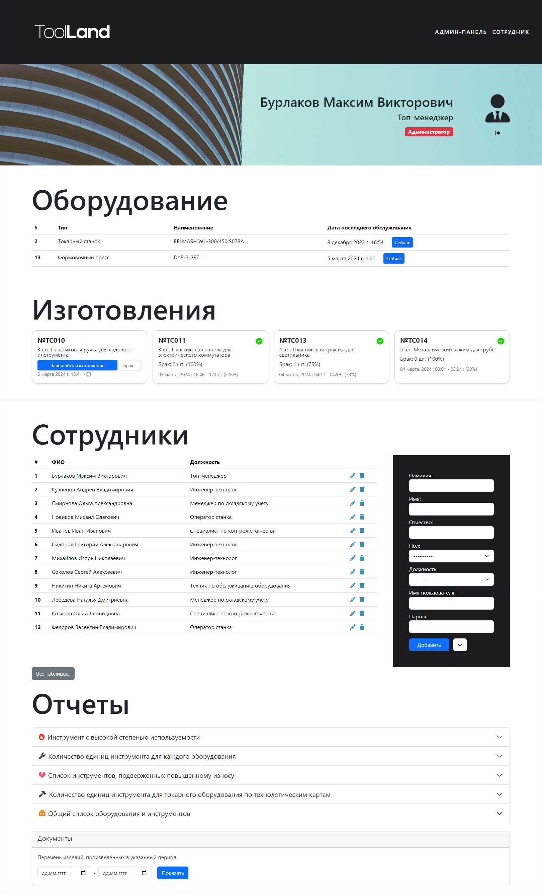

# Инструментальный склад


<table cellpadding="0">
    <tr style="padding: 0">
        <td valign="top"></td>
        <td valign="top"></td>
        <td valign="top"></td>
    </tr>
</table>

Python, Django | Bootstrap

### Техническое задание

Создать БД инструментального склада. Ориентировочные таблицы-составляющие: "Обслуживаемое оборудование", "Инструмент", "Технологические карты", "Рабочие".

Бизнес-логика:
- Увеличение степени износа инструментов после изготовления.
- Разделение прав доступа администратор / сотрудник.
- При создании записи изготовления кол-во требуемых инструментов не должно превышать количество имеющихся.
- При создании записи изготовления требуемое количество инструментов резервируется на время всего изготовления.

Ограничения:
- Все даты не могут быть позже, чем текущая дата.
- Дата конца производства должна быть позже, чем дата его начала.
- Последнее обслуживание оборудования не может быть раньше, чем дата ввода его в эксплуатацию.
- Поля во всех таблицах обязательны к заполнению, кроме записей об ответственных сотрудниках, датах окончания изготовления, количестве брака.
- Количество инструментов, среднее время изготовления являются целыми неотрицательными числами.
- Степень износа является целым числом в диапазоне 0 ÷ 1000.

### Начало работы

```bash
pip install -r requirements.txt
python3 manage.py makemigrations
python3 manage.py makemigrations storage
python3 manage.py migrate
```

### Диаграммы


### Скриншоты


