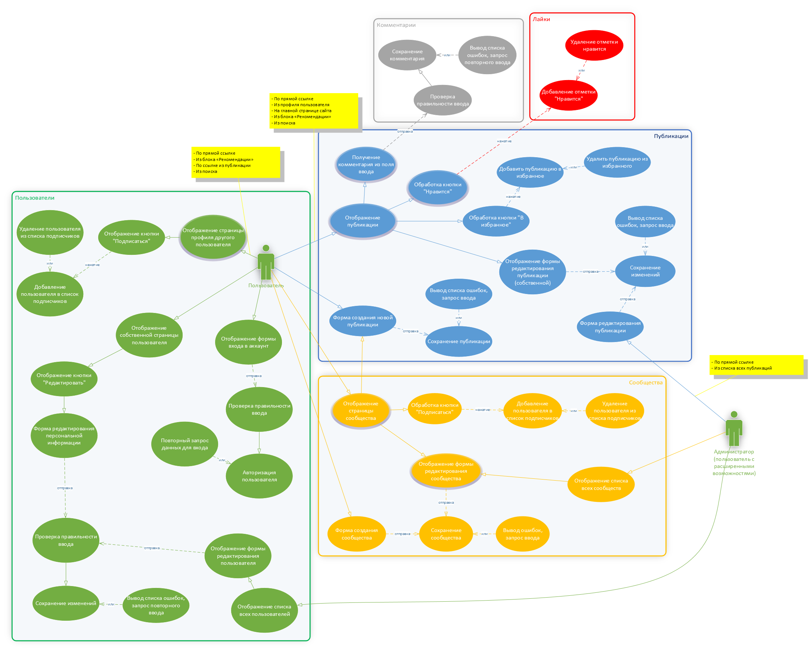
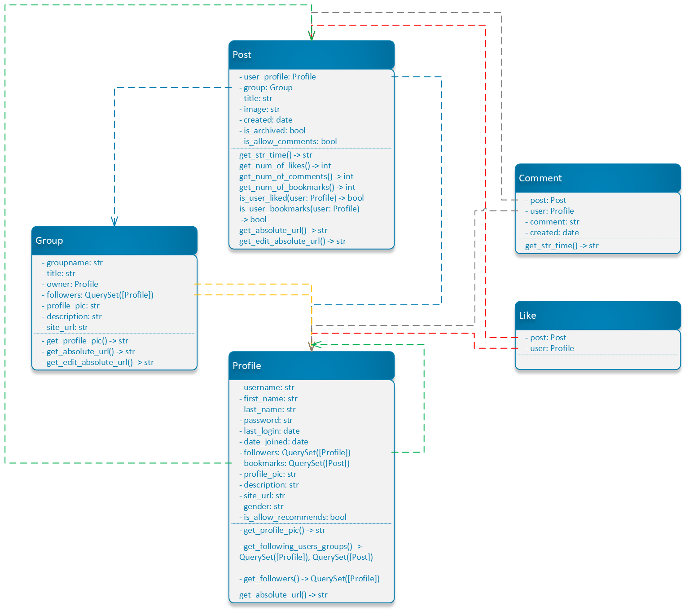
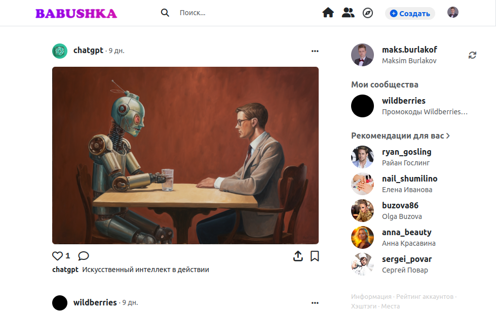
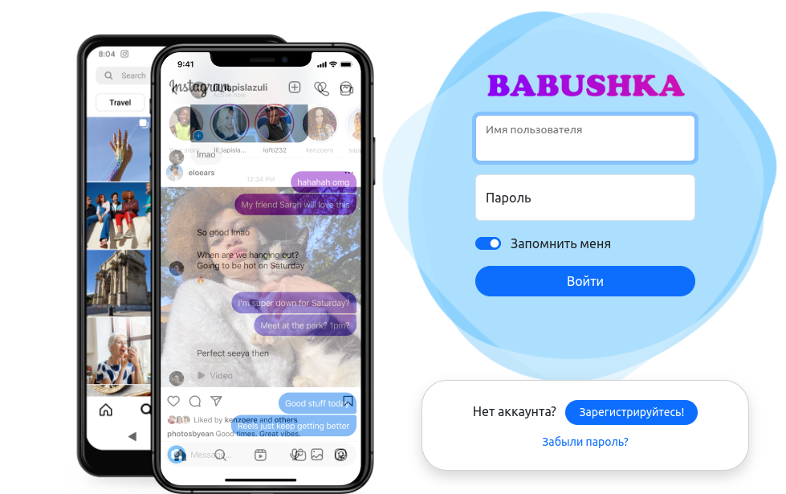
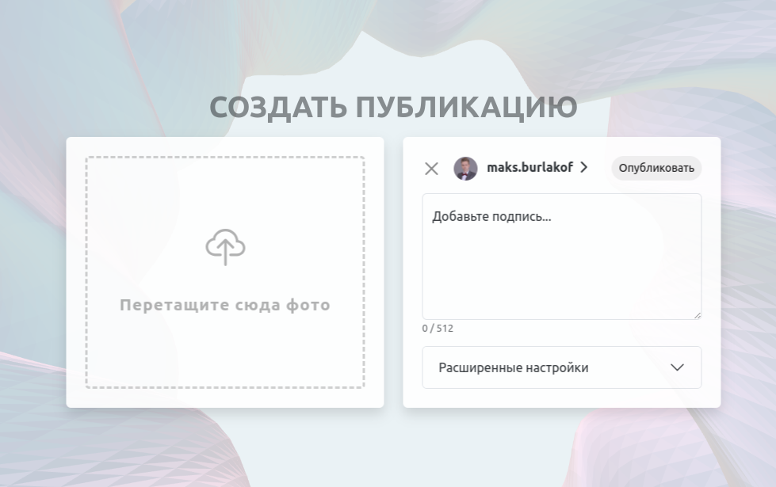
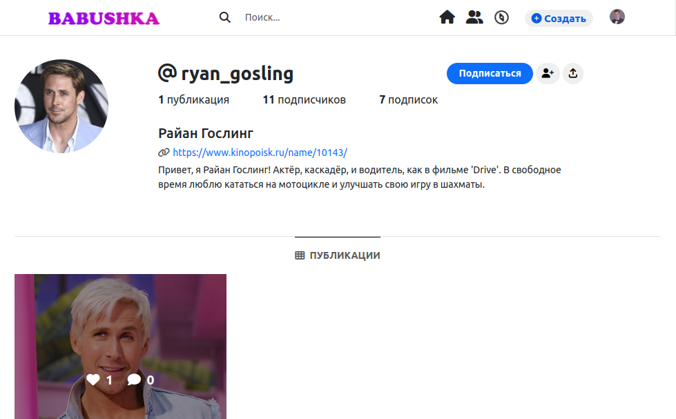
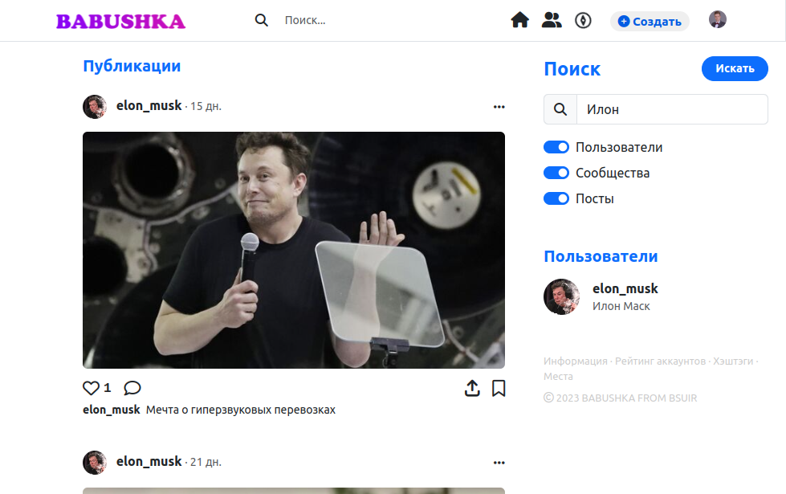

# ТРПОСУ, семестр 5

<table cellpadding="0">
    <tr style="padding: 0">
        <td valign="top">Социальная сеть для обмена фотографиями</td>
        <td valign="top"></td>
    </tr>
</table>

<div style="display: flex; height: 50px">
    
    
    
</div>

Python, Django | Bootstrap

**Навигация**:
- [Техническое задание](#техническое-задание)
- [Начало работы](#начало-работы)
- [UML-диаграммы](#uml-диаграммы)
- [Скриншоты](#скриншоты)

## Техническое задание

Приложение должно предоставлять пользователям возможность делиться фотографиями, оставлять комментарии под ними и удалять их, создавать тематические группы, администрировать их, подписываться на обновления группы.

Реализовать следующие сущности: пользователь, пост, фотография, комментарий, группа.

**Пользователи**. Пользователю принадлежат главное фото профиля, посты, комментарии и группы. Профиль пользователя содержит имя пользователя, фамилию, описание, главное фото профиля. Посты, созданные пользователем должны отображаться на его странице. Создание новых постов и загрузка фотографии профиля совершается также на странице пользователя.

**Фотографии**. Фотографии содержат название, описание и место, где они были сделаны.

**Посты**. Посты содержат фотографию, ее название, описание, место где фотография была сделана, лайки и комментарии.

**Группы**. Группа содержит название, описание, посты и комментарии к ним, подписчиков, главное фото. Пользователь может подписываться на обновления группы, чтобы видеть все посты группы в своей новостной ленте. Пользователи могут создавать группы, в которых администратор может публиковать фотографии от имени группы, удалять посты, удалять подписчиков.

Реализовать новостную ленту, в которой в порядке от более нового до старого отображаются посты из групп, на которые подписан пользователь.

Шапка приложения содержит кнопки для перехода на главную страницу, на страницу с группами, кнопки для выхода из аккаунта и для открытия своего профиля.

На главное странице отображать все посты сайта и авторов постов.

## Начало работы

```bash
pip install -r requirements.txt
python3 manage.py makemigrations
python3 manage.py makemigrations feeds
python3 manage.py migrate

python3 manage.py shell < automation/registration.py
```

## UML-диаграммы

Разработка UML диаграмм программной системы в VS2010 и всеми Team Foundation Studio, Visio2010.

1. Диаграмма вариантов использования. Предусловия, постусловия и исключения. Выделить пользователей системы и определить функции системы.
2. Диаграммы деятельности.
3. Диаграмма классов.




## Скриншоты






